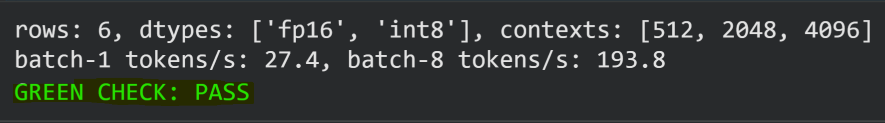

# W3D1 GPU Profiling Lab

Tested `Qwen/Qwen2.5-1.5B-Instruct` on a Tesla T4 using FP16 and INT8 with different context lengths.

## Prediction vs Actual

| Metric | Prediction | Actual |
|---|---:|---:|
| FP16 weights | 3 GB | - |
| INT8 weights | 1.5 GB | - |
| FP16 VRAM @ 512 | 3.5 GB | 3.113 GB |
| FP16 VRAM @ 4096 | 4.5 GB | 3.568 GB |
| GPU utilisation | 50% | 53.3% |

The main thing I expected was that the longer context would use more VRAM, and the results confirmed that.

## Results

| Dtype | Context | VRAM (GB) | GPU Util (%) | Tokens/s |
|---|---:|---:|---:|---:|
| FP16 | 512 | 3.113 | 53.3 | 25.1 |
| FP16 | 2048 | 3.295 | 61.7 | 27.1 |
| FP16 | 4096 | 3.568 | 83.7 | 24.0 |
| INT8 | 512 | 1.805 | 23.5 | 5.5 |
| INT8 | 2048 | 2.035 | 26.3 | 5.3 |
| INT8 | 4096 | 2.309 | 28.5 | 4.9 |

INT8 used less VRAM than FP16, but it was also slower in this test.

## Batch Test

|  | Batch 1 | Batch 8 |
|---|---:|---:|
| GPU Util | 45.0% | 68.0% |
| Tokens/s | 27.4 | 193.8 |

Batch 8 gave about `7.07x` more throughput, while GPU utilisation only increased by 23 percentage points.

This made the main point of the lab clear to me: high GPU utilisation does not always mean high throughput.

## Green Check

