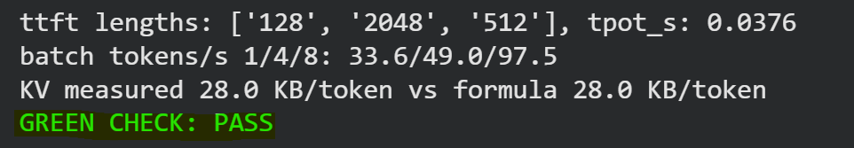

# W3D2 - Inference Anatomy

In this lab I tested inference on `Qwen/Qwen2.5-1.5B-Instruct` using a Tesla T4 GPU.

The main focus was TTFT, TPOT, KV cache growth, and static batching.

## Prediction vs Actual

| Item | Prediction | Actual |
|---|---|---|
| TTFT with longer prompts | It should increase | Increased from 0.0377s at 128 tokens to 0.3061s at 2048 tokens |
| TPOT | Should stay roughly similar because it depends more on model size and memory bandwidth | Stayed around 0.035 - 0.041s |
| KV cache per token | 28 KB/token | 28.0 KB/token |
| Static batching | The batch waits for the longest / slowest request | Batch efficiency dropped when mixed output lengths were used |

For the KV cache, this was calculated before running the measurement:

```text
2 × 28 layers × 2 KV heads × 128 head_dim × 2 bytes
= 28,672 bytes
= 28 KB/token
```

For a 4096-token context:

```text
28 KB × 4096
= 114,688 KB
≈ 112 MB
≈ 0.11 GB
```

The measured KV cache matched the calculation exactly at `28.0 KB/token`.

## TTFT and TPOT

| Prompt Length | TTFT (s) | TPOT (s) | Total Time (s) |
|---:|---:|---:|---:|
| 128 | 0.0377 | 0.0347 | 4.4853 |
| 512 | 0.0673 | 0.0406 | 5.2609 |
| 2048 | 0.3061 | 0.0350 | 4.7832 |

TTFT increased as the prompt became longer because the model had more input tokens to process during prefill.

TPOT stayed relatively close across the three prompt lengths.

## KV Cache

| Context | Total Tokens | Peak KB/token | KV KB/token |
|---:|---:|---:|---:|
| 512 | 768 | 63.4 | 28.0 |
| 2048 | 2304 | 84.0 | 28.0 |
| 4096 | 4352 | 87.6 | 28.0 |

The KV cache itself stayed at `28 KB/token`, while peak memory was higher because it also included activations and temporary workspace.

## Static Batching

| Batch | Wall Time (s) | Tokens/s | Slot Efficiency |
|---:|---:|---:|---:|
| 1 | 62.82 | 33.6 | 1.000 |
| 4 | 43.11 | 49.0 | 0.344 |
| 8 | 21.67 | 97.5 | 0.344 |

Batch 8 improved throughput compared with batch 1:

```text
97.5 / 33.6 ≈ 2.90x
```

But slot efficiency dropped to `0.344` with mixed output lengths because shorter requests had to wait for the longest request in the static batch.

## Baseline

```json
{
  "model": "Qwen/Qwen2.5-1.5B-Instruct",
  "dtype": "fp16",
  "ttft_s": {
    "128": 0.0377,
    "512": 0.0673,
    "2048": 0.3061
  },
  "tpot_s": 0.0376,
  "batch": {
    "1": 33.6,
    "4": 49.0,
    "8": 97.5
  }
}
```

## Green Check

`GREEN CHECK: PASS`

