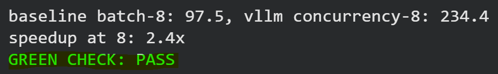
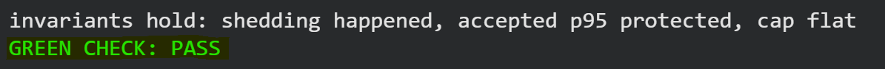

# W3D3 - The Engine Swap

In this lab, I replaced the previous inference setup with vLLM while keeping the same OpenAI-compatible `/v1` API.

I compared vLLM throughput with my W3D2 static batching baseline using concurrency levels 1, 4, and 8.

## Prediction vs Actual

| Metric | Before the Run | Actual |
|---|---:|---:|
| vLLM speedup at concurrency 8 | Predicted: 1.5x | 2.40x |
| Static batching scaling (1 → 8) | Known from W3D2: 2.90x | 2.90x |
| vLLM scaling (1 → 8) | Predicted: 3.5x | 4.29x |
| Continuous batching scaling advantage | Predicted: ~1.2x larger | 1.48x larger |

The static batching scaling was already known from W3D2:

`97.5 / 33.6 = 2.90x`

For vLLM, I predicted around `3.5x` scaling from concurrency 1 to 8.

Based on that prediction:

`3.5 / 2.90 = 1.21x`

So I expected continuous batching to scale about `1.2x` better than static batching.

Actual vLLM scaling:

`234.4 / 54.7 = 4.29x`

Actual continuous batching scaling advantage:

`4.29 / 2.90 = 1.48x`

## Results

| Concurrency | Static Baseline (tokens/s) | vLLM (tokens/s) | Speedup |
|---:|---:|---:|---:|
| 1 | 33.6 | 54.7 | 1.63x |
| 4 | 49.0 | 165.4 | 3.38x |
| 8 | 97.5 | 234.4 | 2.40x |

vLLM scaled better because continuous batching can replace finished requests instead of keeping finished sequences in fixed batch slots.

## Green Check

- Baseline batch-8: 97.5 tokens/s
- vLLM concurrency-8: 234.4 tokens/s
- Speedup at concurrency 8: 2.40x
- GREEN CHECK: PASS

---

## Extra Lab - Load Shedding

In this lab, I tested what happens when many requests are sent to the vLLM server at the same time.

I compared sending 50 requests without any limit and sending them with a limit of 8 requests at a time.

### Prediction vs Actual

| Metric | Prediction | Actual |
|---|---|---|
| 50 requests without a limit | p95 will be much worse | 1.075 s |
| With cap = 8 | accepted p95 will be lower | 0.435 s |
| Requests over the limit | some requests will be rejected | 42 shed |

My prediction was that sending all 50 requests at the same time would increase the latency.

With load shedding, only 8 requests were accepted and the other 42 were rejected quickly.

### Results

Without load shedding:

- Sent: 50
- Successful: 50
- p95: 1.075 s
- Mean: 1.056 s

With load shedding (cap = 8):

- Sent: 50
- Accepted: 8
- Shed: 42
- Accepted p95: 0.435 s

The accepted p95 improved from `1.075 s` to `0.435 s`.

Percentage reduction in p95 latency:

`(old p95 - new p95) / old p95 × 100`

`(1.075 - 0.435) / 1.075 × 100 = 59.5%`

So the p95 was about **59.5% lower** with load shedding.

### Burst Sweep

| Burst Size | Accepted | Shed | Accepted p95 |
|---:|---:|---:|---:|
| 8 | 8 | 0 | 0.506 s |
| 16 | 8 | 8 | 0.391 s |
| 32 | 8 | 24 | 0.391 s |
| 50 | 8 | 42 | 0.377 s |

As the burst size increased more requests were rejected but the p95 for the accepted requests stayed close.

This shows that load shedding can protect latency when the server is overloaded.

### Green Check

- Naive p95: 1.075 s
- Accepted p95: 0.435 s
- Shed requests: 42
- GREEN CHECK: PASS

