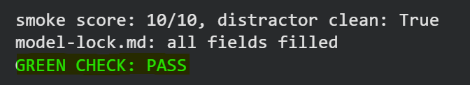

# W3D4 - Quantise and Lock the Model

## Prediction vs Actual

| Item | Prediction | Actual |
|---|---|---|
| VRAM usage | About the same | 11723 MiB, about the same overall |
| Tokens/s | Faster than fp16 | 50.6 tokens/s |
| Valid tool calls | 7 out of 8 | 8 out of 8 tool-required attempts were valid |

The VRAM prediction was correct because vLLM used the freed memory for additional KV-cache blocks instead of leaving it unused.

The tool-calling result was better than predicted, with all 8 tool-required attempts returning valid tool calls.

## Objective

Serve the AWQ version of Qwen2.5-1.5B with vLLM, compare its behaviour with fp16, test function calling, and lock the model for the rest of the course.

## Model

- AWQ: `Qwen/Qwen2.5-1.5B-Instruct-AWQ`
- FP16: `Qwen/Qwen2.5-1.5B-Instruct`
- GPU: Tesla T4
- Tool-call parser: `hermes`

## AWQ Measurements

- VRAM used: `11723 MiB`
- GPU blocks: `22955`
- CPU blocks: `9362`
- Measured throughput: `50.6 tokens/s`

Even though AWQ reduces the model weight size, the total VRAM shown by `nvidia-smi` stayed high because vLLM used the available memory for more KV-cache blocks.

## Quality Spot Check

The same five prompts were tested on both AWQ and fp16.

AWQ maintained similar response quality to fp16, with no obvious degradation across the five prompts.

## Function-Calling Smoke Test

| Model | Score | Distractor Clean | Passed |
|---|---:|---|---|
| AWQ | 10/10 | Yes | Yes |
| FP16 | 10/10 | Yes | Yes |

Both models passed the function-calling gate. AWQ correctly produced valid tool calls when required and avoided calling tools on the distractor prompts.

## Locked Model

`Qwen/Qwen2.5-1.5B-Instruct-AWQ`

AWQ was selected because it passed the smoke test with a perfect score, maintained similar quality to fp16, and provides more KV-cache capacity.

## Final Result

`GREEN CHECK: PASS`

### Green Check

