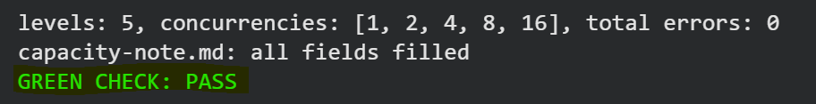
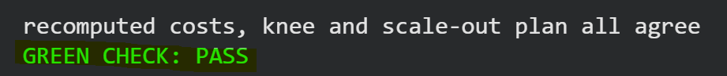
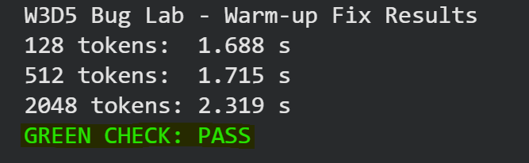

# W3D5 - Benchmark Harness

## Main Lab

### Prediction

- Predicted knee concurrency: `8`
- Target p95 end-to-end latency: `2.0 seconds`

### Benchmark Results

| Concurrency | Tokens/s | TTFT p95 (s) | Latency p95 (s) | Errors |
|---|---:|---:|---:|---:|
| 1  | 92.53  | 0.0701 | 1.3998 | 0 |
| 2  | 173.90 | 0.0872 | 1.4758 | 0 |
| 4  | 290.37 | 0.1016 | 1.6750 | 0 |
| 8  | 482.46 | 0.1590 | 1.8780 | 0 |
| 16 | 709.50 | 0.2374 | 2.3372 | 0 |

### Knee

- Knee concurrency: `8`
- Throughput at knee: `482.46 tokens/s`
- p95 latency at knee: `1.878 s`
- Sustainable request rate: `4.65 req/s`

Concurrency `16` increased throughput, but its p95 latency reached `2.3372 s`, which exceeded the `2.0 s` target.

### Bottleneck

The workload is likely memory-bound during decode.

### Stretch

I also tested concurrency `32`.

- Throughput: `823.95 tokens/s`
- p95 latency: `2.516 s`

The higher concurrency increased throughput, but the gain became smaller while latency continued to increase.

### Green Check

---

## Extra Lab - Cost per Million Tokens and Scale-Out

At the knee:

- Concurrency: `8`
- Throughput: `482.46 tokens/s`
- p95 latency: `1.878 s`
- Cost per million tokens: `$0.2015`

At concurrency `16`, the cost dropped to `$0.137` per million tokens, but the p95 latency increased to `2.3372 s`, which exceeded the SLO.

For `2x` the knee throughput, the scale-out plan requires `2 replicas` with a total cost of `$0.70/hour`.

### Extra Lab Green Check

---

## Bug Lab - Benchmark Warm-up

The first benchmark run was slower because it included one-time first-call overhead.

### Before the Fix

- 128 tokens: `4.572 s`
- 512 tokens: `2.112 s`
- 2048 tokens: `2.436 s`

### After Adding a Warm-up

- 128 tokens: `1.688 s`
- 512 tokens: `1.715 s`
- 2048 tokens: `2.319 s`

After the warm-up, latency increased normally with context length.

### Bug Lab Green Check

